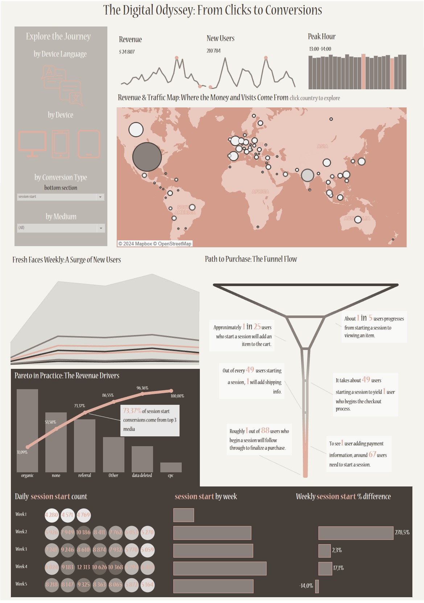

# 📊 Conversion Analysis with Google BigQuery and Tableau

## Overview
This project involves analyzing conversion metrics from the Google Analytics 4 (GA4) dataset using Google BigQuery and visualizing the results with Tableau. The analysis aims to provide insights into conversion patterns and key performance indicators (KPIs) to help optimize marketing strategies.

## Project Steps

### 1. Data Extraction and Aggregation
- **Objective:** Extract and aggregate session data to analyze conversion metrics and other relevant details.
- **Details:** The SQL query extracts and aggregates data from the GA4 dataset to calculate various conversion metrics and key performance indicators.

### 2. Interactive Tableau Dashboard
- **Objective:** Visualize the extracted data and KPIs using Tableau to provide actionable insights.
- **Visualizations:**
  - **Revenue Overview:**
  - **New Users Trend:**
  - **Peak Traffic Hours:**
  - **Pareto Chart of Key Revenue Drivers by Medium:**
  - **Traffic and Revenue Source Map:**
  - **Conversion Funnel Chart:**
  - **Event Statistics by Day and Week:**
    
    

You can view the interactive dashboard on my Tableau Public profile:

[Tableau Dashboard](https://public.tableau.com/views/CustomerJourney_17260835284590/Dashboard1?:language=en-US&:sid=&:redirect=auth&:display_count=n&:origin=viz_share_link)

## 🚀 Results
- **Revenue Insights:** Provided a clear view of revenue trends and key revenue drivers by medium.
- **New User Trends:** Identified patterns in new user acquisition over time.
- **Peak Traffic Hours:** Highlighted the hours with the highest traffic to optimize marketing efforts.
- **Conversion Funnel Analysis:** Showed the conversion process from initial view to purchase.
- **Event Statistics:** Offered detailed breakdowns of event statistics by day and week.

## 📂 Project Files
- **BigQuery SQL Query:** [bigquery_query.sql](bigquery_query.sql)

## License
This project is licensed under the MIT License. See the [LICENSE](LICENSE) file for details.

## Contact
For any questions or feedback, please contact me at [justynacurzytek06@gmail.com](justynacurzytek06@gmail.com).
